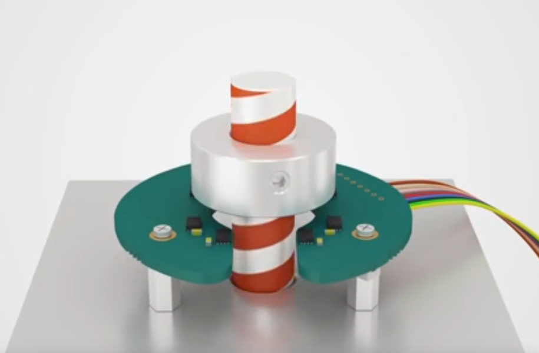
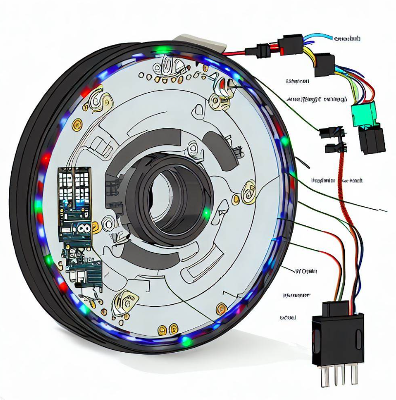

## Comparison of magnetic and optical encoder:

## Encoder Design Ideas:
* * 

Links:
* [Hoverboard motor with built in magnetic encoder](https://www.youtube.com/watch?v=8GpIuEcT-QM)

## Optical Encoder
### Components
    1. Optical Disc
    2. LED  and Photodetector
    3. Optical Encoder Housing
    4. Coupling and Shaft
        * A coupling connects the optical encoder shaft with the hoverboard wheel shaft.
        * A shaft is required to connect the optical encoder with the coupling.
    5. Wiring and Connectors
    6. Encoder cover

