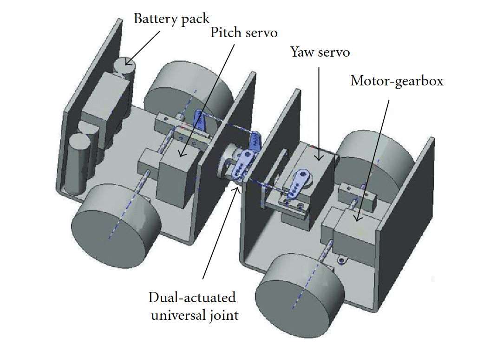

# Mounting of two robots design ideas:
## Bracket Mounting
...
## Clamping
...
## Magnetic Mounting
...
## Docking Stations
...
## Universal Joints

* 

* [Link: Design and Steering Control of a Center-Articulated Mobile
Robot Module](https://www.researchgate.net/journal/Journal-of-Robotics-1687-9619/publication/258380101_Design_and_Steering_Control_of_a_Center-Articulated_Mobile_Robot_Module/links/62061eb37b05f82592e0363d/Design-and-Steering-Control-of-a-Center-Articulated-Mobile-Robot-Module.pdf)

## Couplings
...

# Suspension Systems
## Spring Systems
...
## Dampers
...
## Anti-roll Bars
...
## Struts
...

# Links:
* [Suspension Systems](https://citeseerx.ist.psu.edu/document?repid=rep1&type=pdf&doi=f1b742c172a0f953fbd75c512acb28698bd65cf6)
* [Air spring Suspension](https://downloads.hindawi.com/archive/2015/974020.pdf)
* [Articulated multi-monocycle mobile robots](https://sci-hub.hkvisa.net/10.1109/robot.2006.1641921)
* [Folding Table Concept](https://www.youtube.com/watch?v=q4-mNUxWrjo&t=26s)
