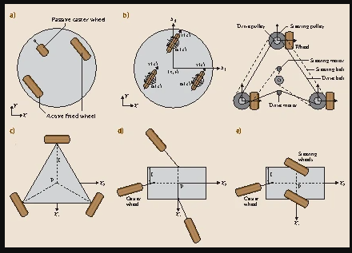

# Design Ideas
_Here we enter our ideat as draft and preliminary work of us._

## Types of Wheels

### Tracked vehicles/Continuous track
* High traction on rough, soft or uneven surface/terrain
* Increased payload capacity in terms of maximum weight
* BUT
* Slow speed compared to other wheel designes due to increase firiction
* High wheel worn and energy consupmtion
* Poor performance on on-road/smooth surfaces in terms of speed, maneuverability, and ride comfort.
* High cost and complexity

### Four-Wheeled
*   

### Three-Wheeled
* * 

### Two-Wheeled
* ...
* Two indep wheel and free ball wheel
* Road and obstacle detection through camera instead of LiDAR
* Over a specified and defined terrain not for all
* MUTUAL MOTION
	* cannot the both be indep or dep, can arranged/ajdusted simultaneously
	* how to detect other robot and its position and orientation together
	* 

### Other Types
* See our reference [Chung, W., & Iagnemma, K. (2016). Wheeled robots. Springer Handbook of Robotics, 575-594.](https://link.springer.com/chapter/10.1007/978-3-319-32552-1_24)

## Robot Stablity

### Handling Distortion

#### Suspension System
* MahPerson
* DoubleWishBone
* Dumping effect of hooverboard wheel and its stiffness in the constext of of robot/vehicle's stability
* Compatiiblity of suspension system to be used.
* They all are dependent on style of driving.The betted the drive control better the terrain grab.
* 

#### Gimbal Stabilization
* ...

#### Sensor fusion
* ...

#### Kalman Filtering
* ...

#### Motion Planning
* ...

## Manufacturing   Materials and Methods

### Sigma Profiles
* What to be used for
* In which parts to be used
* ...

### 3D Printing
* ...

### Bending, Drilling etc.
* ...

## Payloads on the Robot

### Camera

* What camera? properties?
* ...

### Encoders

* Are they needed? 
* Optical Encoder
* Magnetic encoders

### ...

## Robot's Mechanics and Its Design

* Easy to be charged, self-charge is desired but not an obligation
* Sensor nest
* Modularity
* Neat look

